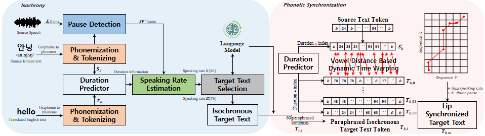

## PS-TTS: Phonetic Synchronization in Text-to-Speech for Achieving Natural Automated Dubbing


The Pytorch implementation of PS-TTS (AAAI 2025)



<p align="center"><em> Overall architecture </em>
<p style="text-align: justify;">
> Recently, artificial-intelligence-based dubbing technology has significantly advanced, enabling automated dubbing (AD) to effectively convert the source speech of a video into target speech in different languages. However, achieving natural AD still faces lip-sync challenges in the dubbed video, which is crucial for preserving the viewer experience. It has been popular to use a deep fake technique for lip-sync by altering the video contents with the translated text and synthesized target speech. Instead, this paper proposes a method of achieving lip-sync by paraphrasing the translated text in an AD pipeline. The proposed method comprises two processing steps: isochrony for the timing constraint between source and target speech and phonetic synchronization (PS) for lip-sync without altering the video contents. First, an isochrony approach is proposed for the AD between the languages with different structures to match the duration of the target speech with that of the source speech. This is performed by paraphrasing the translated text using a language model to achieve isochrony. Second, a lip-sync method is also proposed to paraphrase the isochronous target text by using PS, motivated by vowels that are directly related to mouth movements during pronunciation. The proposed PS method employs dynamic time warping with local costs of vowel distances measured from the training data so that the target text is composed of target vowels with similar pronunciations of source vowels. The proposed isochrony and PS methods are incorporated into a text-to-speech system, which is referred to as PS-TTS. The performance of the PS-TTS is evaluated using Korean and English lip-reading datasets and a voice actor dubbing test set by collecting data from films. Experimental results demonstrate that PS-TTS outperforms the TTS with PS in terms of several objective qualities. Moreover, it provides comparable performance to voice actors in Korean-to-English as well as English-to-Korean dubbing.

## 🔊 Requirements
&nbsp;&nbsp;&nbsp;&nbsp;&nbsp;&nbsp;✔︎&nbsp;&nbsp;&nbsp;Platforms: Ubuntu 20.04<br>
&nbsp;&nbsp;&nbsp;&nbsp;&nbsp;&nbsp;✔︎&nbsp;&nbsp;&nbsp;Python >= 3.8<br>
&nbsp;&nbsp;&nbsp;&nbsp;&nbsp;&nbsp;✔︎&nbsp;&nbsp;&nbsp;apt update -y && apt install gcc libsndfile1 -y<br>
&nbsp;&nbsp;&nbsp;&nbsp;&nbsp;&nbsp;✔︎&nbsp;&nbsp;&nbsp;GPU: We use V100 with CUDA 11.4 for PS-TTS process<br>

## ⚙️ Setup
1. Clone this repository and Install python requirement

```
git lfs clone https://github.com/hayeong0/DDDM-VC.git
conda activate ps_tts
pip install -r requirements
``` 
you need to install `apt-get install espeak` first. <br>
`lfs` is need for download pre-trained baseline TTS model<br><br>
If you clone the repository using `git clone https://github.com/hayeong0/DDDM-VC.git`<br>
pleanse download checkpoint `./ckpts/baseline.pth` separately<br>

## 📑  Usage
### Prepare  Data

-  For inference data you need 1) Input Video, 2) Source Speech, 3) Source text, 4) BGM
- This repository provides code for the synchronization method proposed in PS-TTS, but it does not provide results for source separation or automatic speech recognition results.
- If you want to separate the source speech from a video in MP4 format, run `bash separate_video.sh <input_video_path> <output_audio_path> <output_video_path>`.<br>
for example, `bash separate_video.sh ./input_video/input_video_kr.mp4 ./prepare_data/output.wav ./prepare_data/separated_video.mp4`
- If you are using your own data, use a video without BGM, or separate the BGM using the open-source tool available at `https://github.com/sigsep/open-unmix-pytorch.git`.

**When time alignment for the source text is not available:**

```
inference.txt
0001 {source text}
0002 {source text}
```
<br>*FIRST* Replace `{source text}` with the actual text. For example:

```
inference.txt
0001 Hello, how are you?
0002 I am fine, thank you.
```
Make sure each line contains text from only one speaker.<br><br>
*SECOND* You need to obtain the time alignment that matches the speech segments in the text.
```
inference.txt
0001 onset offset Hello, how are you?
0002 onset offset I am fine, thank you.
```
Please specify the onset and offset times.
If you are using your own data, you can manually provide the time alignment, or you can use the open-source tool available at `https://github.com/linto-ai/whisper-timestamped.git`<br>

**Example Provided**

Below is an example of the voice actor sample. This provides an example for inference:
```
inference.txt
0001 0.00 2.35 Hello, how are you?
0002 2.36 4.80 I am fine, thank you.
```


<br>You can use the provided voice actor sample to perform inference with PS-TTS.<br>The sample includes an `inference.txt` formatted source text, source speech, video, and a separated BGM.
```
voice_actor_sample.txt
0001	0.74	2.91	더 좋은 옷, 더 좋은 차
0002	4.19	7.15	더 좋은 집에 산다는 이유로 친구를 괴롭히지 말 것.
```

### 🔑 Inference for PS-TTS

After preparing the .txt file, follow the steps below for korean-to-english dubbing:<br>
The following example demonstrates how to dub using the provided voice actor data
```
python inference_kr_to_en.py \
    --src_speech 'prepare_data/vocals.wav' \
    --src_bgm 'prepare_data/bgm_mixer.wav' \
    --src_text 'prepare_data/voice_actor_sample.txt' \
    --trg_speech 'output/output.wav' \
```

Test it on your own Korean and English samples!!<br><br>
If you want to test with your English samples, please follow the steps below:

```
python inference_en_to_kr.py \
    --src_speech '{}' \
    --src_bgm '{}' \
    --src_text '{}' \
    --trg_speech '{}' \
```

Additionally, replace the input files with those matching the correct paths to proceed with PS-TTS.

*FINALLY*  Combine the lip-synchronized target speech with the source video. `bash separate_video.sh <input_video_path> <final_output_speech>`

## 🎓 Dubbing Sample with Lip-Reading Datasets

<h4 style="text-align: center; font-size: 24px;">English-to-Korean Dubbing</h4>
<div style="display: flex; justify-content: center;">
  <div style="flex: 1; margin-right: 10px; text-align: center; max-width: 45%;">
  </div>
  <div style="flex: 1; text-align: center; max-width: 45%;">
    <video width="100%" controls>=
      <source src="https://github.com/user-attachments/assets/fa6ea2dc-d4f5-4a54-b529-ee632f2caf3c" type="video/mp4">
      Your browser does not support the video tag.
    </video>
  </div>
</div>
<div style="display: flex; justify-content: center;">
  <div style="flex: 1; margin-right: 10px; text-align: center; max-width: 45%;">
    <video width="100%" controls>
      <source src="./samples/women_eg_sample.mp4" type="video/mp4">
      Your browser does not support the video tag.
    </video>
  </div>
  <div style="flex: 1; text-align: center; max-width: 45%;">
    <video width="100%" controls>
      <source src="./samples/women_eg_kr.mp4" type="video/mp4">
      Your browser does not support the video tag.
    </video>
  </div>
</div>
<table>
  <tr>
    <td>
      
    </td>
    <td>
      
    </td>
  </tr>
  <tr>
    <td>
      
    </td>
    <td>
      
    </td>
  </tr>
</table>
<h4 style="text-align: center; font-size: 24px;">Korean-to-English Dubbing</h4>
<div style="display: flex; justify-content: center;">
  <div style="flex: 1; margin-right: 10px; text-align: center; max-width: 45%;">
    <video width="100%" controls>
      <source src="./samples/input_kr.mp4" type="video/mp4">
      Your browser does not support the video tag.
    </video>
  </div>
  <div style="flex: 1; text-align: center; max-width: 45%;">
    <video width="100%" controls>
      <source src="./samples/men_kr_eg.mp4" type="video/mp4">
      Your browser does not support the video tag.
    </video>
  </div>
</div>
<div style="display: flex; justify-content: center;">
  <div style="flex: 1; margin-right: 10px; text-align: center; max-width: 45%;">
    <video width="100%" controls>
      <source src="./samples/input_video.mp4" type="video/mp4">
      Your browser does not support the video tag.
    </video>
  </div>
  <div style="flex: 1; text-align: center; max-width: 45%;">
    <video width="100%" controls>
      <source src="./samples/men2_kr_eg.mp4
" type="video/mp4">

      Your browser does not support the video tag.
    </video>
  </div>
</div>
<table>
  <tr>
    <td>
      
    </td>
    <td>
      
    </td>
  </tr>
  <tr>
    <td>
      
    </td>
    <td>
      
    </td>
  </tr>
</table>
